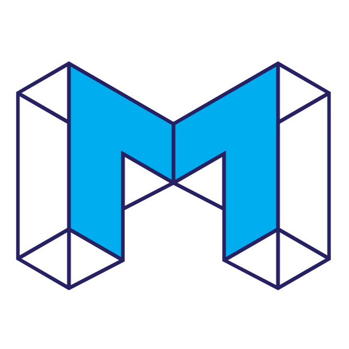

# protocol

**An Asset Creation,Issuance and Governance Protocol for Data DAO**

Mission:**Building Finance first Data DAO Asset Creation and Issuance Protocol**

Vision:**Open Finance First, Open Data Second, Open AI Third**

#### problems: 

First , the Internet has made distribution (of digital goods) free, neutralizing the advantage that pre-Internet distributors leveraged to integrate with suppliers. Secondly, the Internet has made transaction costs zero, making it viable for a distributor to integrate forward with end users/consumers at scale.

#### solutions:

We give people partial ownership of the network. Just like equity in a startup, it is more valuable to join the network early because users get more ownership. Decentralized applications do this by paying their contributors in their token. And there is potential for that token (partial ownership of the network) to be worth more in the future. This is equivalent to being a miner in the early days of Bitcoin. When the network is less populated and useful ,you will have a stronger incentive to join it.

#### keys:

When The flywheel of network effects apply to a decentralized organization or network, decentralized governance can act as the flywheel of network effects. As more participants join and contribute to the network, the decentralized governance model allows for more diverse perspectives and ideas to be considered in decision-making. This inclusivity can lead to better decisions, increased trust, and a stronger sense of community, which in turn attracts more participants, further strengthening the network effects.

## Contribute

We’re developing Mount, an Filecoin protocol that establishes DataDAO with algorithmically set interest rates; users and dApps will be able to earn interest on FIL and tokens, and borrow Ether and tokens to invest, use, or short-sell.

The Mount protocol is a set of rules and procedures that govern the creation, issuance, and management of assets within the decentralized autonomous organization (DAO) focused on data management and governance.

1.**Asset Creation**: The protocol outlines the process for creating new assets within the Data DAO. This may include data tokens, data shares, or other digital assets that represent ownership or access rights to data within the DAO.

2.**Issuance**: The protocol defines the rules for issuing new assets to members of the DAO. This may involve a token sale, airdrop, or other distribution methods, and will include guidelines for determining the quantity and distribution of new assets.

3.**Governance**: The protocol establishes the governance structure for managing and making decisions about the assets within the Data DAO. This may include voting mechanisms, decision-making processes, and rules for modifying or updating the protocol itself.

4.**Compliance**: The protocol ensures that all asset creation, issuance, and governance activities are compliant with relevant regulations and best practices. This may involve legal review, compliance checks, and ongoing monitoring of asset activities.
5.**Transparency**: The protocol requires that all asset creation, issuance, and governance activities are transparent and accessible to all members of the Data DAO. This may include public records, open meetings, and regular reporting on asset activities.
Overall, the Asset Creation, Issuance, and Governance Protocol for Data DAO is designed to ensure that the creation and management of assets within the DAO are fair, transparent, and compliant with relevant regulations. By following these rules and procedures, the Data DAO can effectively manage and govern its assets to achieve its goals of data management and governance.

## Related contracts

**Voting contract:**

1.Datadao can control data to perform a series of operations, such as: receiving data, renewing data storage, and controlling user access to data.

2.Datadao can control the fund pool on the chain and manage the allocation of funds on the chain.

**reference**:

1.https://github.com/GeekyAnts/sample-e-voting-system-ethereum

2.https://github.com/madrona-labs/voting	  

3.https://github.com/VirginiaBlockchain/QuadraticVotingDapp

**Mount contract:**

1.Users can store data in filecoin and wait for datadao voting review.

2.Datadao provides users with data funding, and the ownership of the data belongs to datadao,after the data is stored in filecoin.

3.Datadao generates the corresponding DealID and gives it to the user as an NFT certificate,after datadao votes and uploads the data.

**reference**:

smart contracts in wrap protocol

[ERCs/ERCS/erc-7527.md at lanyinzly-patch-1 · lanyinzly/ERCs (github.com)](https://github.com/lanyinzly/ERCs/blob/lanyinzly-patch-1/ERCS/erc-7527.md)

**Permanent storage contract:**

1.Datadao can manage Renewal operation of DealID of data.

2.Datadao controls the data uploaded by users to be stored on filecoin.

**reference**:

1.https://github.com/FILCAT/client-contract

2.https://github.com/FILCAT/deal-bounty-contract

3.https://github.com/FILCAT/dotStorage-deal-renewal

**Market contract:**

1.Datadao can auction data and define a starting price. investors can participate in the bidding for the required data.

2.Datadao can trade data with investors, and datadao defines the price of data.

**reference**:

1.https://github.com/oceanprotocol/contracts/tree/main

## Official Website

https://mountprotocol.xyz/
